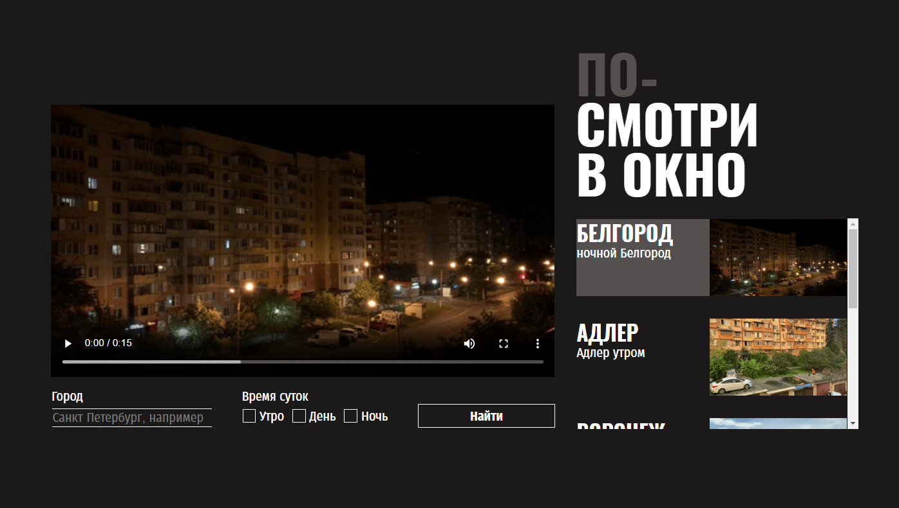

https://github.com/Fren4okolate/posmotri_v_okno

# Яндекс Практикум, проект "Посмотри в окно"

## Оглавление

- [Скриншот](#скриншот)
- [Макет](#макет)
- [Ссылки](#ссылки)
- [Автор](#автор)

### Скриншот

### Макет

- Макет задания: [Figma](https://www.figma.com/design/QHcvX1RsUI89CulRB7HLk6/%234-Посмотри-в-окно?node-id=301-98&node-type=frame)

### Ссылки

- URL решения: [Github](https://github.com/Fren4okolate/posmotri_v_okno/)

 ## Автор
 
  - Github - [Fren4okolate](https://github.com/Fren4okolate/)
